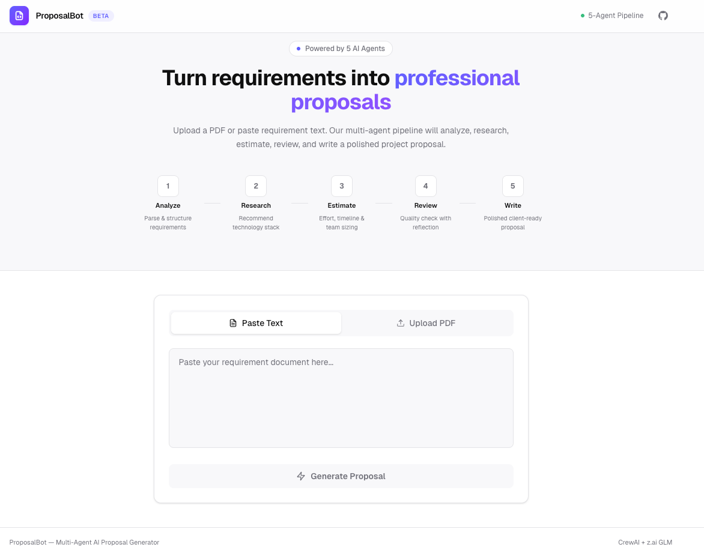

# ProposalBot

> Multi-agent AI system that transforms requirement documents into professional project proposals.

Built as a POC for the [Agentic AI](https://www.deeplearning.ai/courses/agentic-ai/) course by Andrew Ng (DeepLearning.AI). Demonstrates all four agentic design patterns: **Reflection**, **Tool Use**, **Planning**, and **Multi-Agent Systems**.



## How It Works

Upload a PDF or paste requirement text → a 5-agent AI pipeline analyzes, researches, estimates, reviews, and writes a polished project proposal.

```
Requirement Doc → [Analyzer] → [Researcher] → [Estimator] → [Reviewer] → [Writer] → Proposal
                                                                  ↑           │
                                                                  └── 🔄 ─────┘
                                                               (reflection loop)
```

## Quick Start

### Prerequisites

- Python 3.11+ with [uv](https://docs.astral.sh/uv/)
- Node.js 18+
- An LLM API key (z.ai, OpenAI, etc.)

### Option 1: Docker (recommended)

```bash
git clone <repo-url> && cd proposal_bot

# Configure environment
cp backend/.env.example backend/.env
# Edit backend/.env — add your LLM_API_KEY

docker compose up --build
```

- Frontend → http://localhost:3000
- Backend API → http://localhost:8000/docs

### Option 2: Run locally

```bash
# Backend
cd backend
cp .env.example .env          # Add your API key
uv sync                       # Install dependencies
uv run uvicorn app.main:app --reload --port 8000

# Frontend (separate terminal)
cd front-end
npm install
npm run dev
```

## Configuration

All config lives in `backend/.env` (see [.env.example](backend/.env.example)):

| Variable | Default | Description |
|---|---|---|
| `LLM_API_KEY` | — | **Required.** Your LLM provider API key |
| `LLM_MODEL` | `glm-5.1` | Model name (see providers below) |
| `LLM_API_BASE` | `https://api.z.ai/api/paas/v4/` | API base URL for OpenAI-compatible providers |
| `MAX_REVISION_ROUNDS` | `1` | Max reflection loops (Reviewer → Estimator) |
| `CORS_ORIGINS` | `http://localhost:3000` | Comma-separated allowed origins |

### Supported LLM Providers

| Provider | `LLM_MODEL` | `LLM_API_BASE` |
|---|---|---|
| z.ai (default) | `glm-5.1` | `https://api.z.ai/api/paas/v4/` |
| OpenAI | `gpt-4o` | _(leave empty)_ |
| Gemini | `gemini/gemini-1.5-pro` | _(leave empty)_ |
| Ollama (local) | `ollama_chat/llama3` | _(leave empty)_ |
| Anthropic | `anthropic/claude-sonnet-4-20250514` | _(leave empty)_ |

## Tech Stack

| Layer | Technology | Purpose |
|---|---|---|
| Frontend | Next.js 16 + Tailwind CSS 4 | SaaS-style web UI |
| Markdown | react-markdown + remark-gfm | Render proposals with tables |
| PDF Export | html2pdf.js | Client-side PDF download |
| Backend | Python FastAPI | REST API server |
| Agents | CrewAI 0.86 | Multi-agent orchestration |
| LLM | z.ai GLM-5.1 / OpenAI (via LiteLLM) | Language model backend |
| PDF Parse | pdfplumber | Extract text from uploaded PDFs |
| Package Mgmt | uv | Fast Python dependency management |
| Deployment | Docker Compose | One-command local setup |

## Agentic Design Patterns

| Pattern | Implementation |
|---|---|
| **Reflection** | Reviewer agent critiques estimation → triggers revision if quality is insufficient |
| **Tool Use** | PDF parsing via pdfplumber for document ingestion |
| **Planning** | Sequential 5-stage pipeline with progress tracking and stage orchestration |
| **Multi-Agent** | 5 specialized agents (Analyzer → Researcher → Estimator → Reviewer → Writer) via CrewAI |

## Project Structure

```
proposal_bot/
├── backend/
│   ├── app/
│   │   ├── main.py              # FastAPI app + routes
│   │   ├── config.py            # Environment config + LLM setup
│   │   ├── models.py            # Pydantic models
│   │   ├── agents/              # 5 CrewAI agent definitions
│   │   │   ├── analyzer.py
│   │   │   ├── researcher.py
│   │   │   ├── estimator.py
│   │   │   ├── reviewer.py
│   │   │   └── writer.py
│   │   ├── crew/
│   │   │   ├── tasks.py         # Task definitions with context passing
│   │   │   └── pipeline.py      # Pipeline orchestration + reflection loop
│   │   ├── services/
│   │   │   ├── pdf_parser.py    # pdfplumber text extraction
│   │   │   └── job_store.py     # In-memory job tracking
│   │   └── utils/
│   │       └── helpers.py       # Token truncation, sanitization
│   ├── pyproject.toml
│   ├── Dockerfile
│   └── .env.example
│
├── front-end/
│   ├── app/
│   │   ├── page.js              # Main page + polling logic
│   │   ├── layout.js            # Root layout + fonts
│   │   └── globals.css          # Design system + animations
│   ├── components/
│   │   ├── Header.js            # SaaS header with branding
│   │   ├── InputSection.js      # Text/PDF input tabs
│   │   ├── ProgressTracker.js   # Pipeline progress pills
│   │   ├── AgentOutputCard.js   # Expandable agent output
│   │   └── ProposalView.js      # Markdown render + PDF download
│   └── lib/
│       └── api.js               # API client + stage definitions
│
├── docs/                        # Detailed documentation
├── sample_docs/                 # Test requirement documents
├── script/                      # Report generation script + screenshot
├── docker-compose.yml
└── README.md
```

## Sample Documents

Test the pipeline with the sample requirement docs in [`sample_docs/`](sample_docs/):

- `ecommerce_requirements.txt` — E-commerce platform requirements
- `saas_platform_brief.txt` — SaaS analytics dashboard brief

## Documentation

| Document | Description |
|---|---|
| [Course Assignment](docs/assignment.md) | Course summary, key learnings, work application, recommendations |
| [POC Proposal](docs/poc-proposal.md) | ProposalBot scope, features, user flow |
| [Architecture](docs/architecture.md) | System design, tech choices, key decisions |
| [API Design](docs/api-design.md) | Endpoints, request/response models, polling flow |
| [Agent Pipeline](docs/agent-pipeline.md) | Agent roles, reflection logic, pipeline execution |

---

**Author:** Zulkar Nayin (11374) — BJIT Limited  
**Course:** [Agentic AI](https://www.deeplearning.ai/courses/agentic-ai/) — DeepLearning.AI
